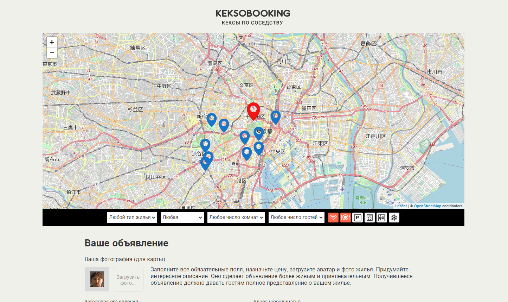

# Учебный проект «Кексобукинг» — сервис размещения объявлений.

Кексобукинг — сервис размещения объявлений о сдаче в аренду недвижимости в центре Токио. Пользователям предоставляется возможность размещать объявления о своей недвижимости или просматривать уже размещённые объявления.

## Ссылка

[Ссылка проекта на GitHub Pages](https://mtokmin.github.io/Keksobuking/)

## Скриншот

## Цель проекта

Целью проекта была практика по JavaScript. Весь код написан в функциональном стиле программирования, использованы модули JS. Также использована внешняя библиотека для работы с картами - Leaflet.

## Автор

**Токмин Михаил**

telegram: [@hidrargium](https://t.me/hidrarguim)

